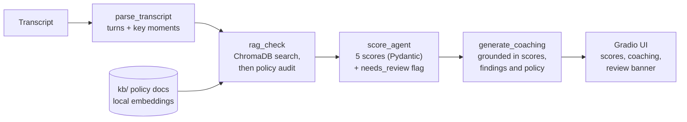

# Call Quality Copilot

Built as a technical demonstration of LangGraph multi-agent pipelines with RAG and human-in-the-loop routing.


Paste a support-call transcript (or pick one of 10 samples) and the copilot scores the agent on five dimensions,
checks what the agent said against a policy knowledge base, writes coaching notes, and flags outlier results for
a person to review. All company data is fictional ("Nextel Communications").

## Architecture



The four nodes run in a LangGraph `StateGraph` over one typed state:

```python
class State(TypedDict):
    transcript: str
    parsed: dict          # speaker turns, key moments
    rag_findings: list    # policy violations found
    scores: dict          # 5 dimensions, 1-5 each
    coaching: list        # 2-3 specific recommendations
    needs_review: bool    # HITL flag
```

| Node | What it does |
|---|---|
| `parse_transcript` | Splits `Agent:` / `Customer:` turns and extracts key moments (emotion, refund or billing talk, escalation requests, recording disclosure, verification, promises, dead air) plus stats such as repeated sentences and repeated PIN requests. Plain Python, no LLM. |
| `rag_check` | Embeds the key moments and agent turns, searches a ChromaDB index of `kb/`, then asks Claude which of the retrieved policies the agent broke. Output: findings with quote, turn number and severity. |
| `score_agent` | One structured-output call into a Pydantic model: `empathy`, `accuracy`, `resolution`, `efficiency`, `script_adherence`, each an integer 1-5 with a rubric in its `Field` description. Sets `needs_review`. |
| `generate_coaching` | 2-3 specific recommendations grounded in the scores, the findings and the retrieved policy text. |

### Human-in-the-loop rule

`needs_review` is set when **any score is below 2** (a severe failure) or the **average is above 4.5** (a call that
looks too perfect). LangGraph edges can only route, not write state, so the rule lives in `needs_human_review()`
and is applied at the end of `score_agent`.

## What this demonstrates

- A typed LangGraph pipeline where each node has one job and the LLM is only used where judgment is needed.
- RAG that ends in a decision, not a summary: retrieval feeds a policy audit, whose findings feed scoring and coaching.
- Structured outputs validated with Pydantic, with a retry, and errors that say what went wrong (out of credits,
  bad key, unparseable transcript).
- A human-review rule chosen from measured behaviour rather than assumed (see below).
- Cost awareness: the default model was picked by comparing three Claude models on the same calls.

## Where it applies

- **Contact-centre QA:** score a sample of calls consistently instead of a few hand-reviewed ones.
- **Compliance monitoring** in regulated industries: identity verification, recording disclosure, unauthorized
  promises, mishandled regulator threats.
- **Agent coaching:** specific, quote-level feedback tied to the exact turn.
- **Supervisor triage:** only outlier calls go to a person.

Swap the files in `kb/` for a real company's policies and the same pipeline audits against them.

## Results on the 10 sample calls

`kb/` holds five policy documents; `samples/` holds ten transcripts written against them. Score order is
empathy / accuracy / resolution / efficiency / script adherence. These came from one live run on Claude Opus 5.

| Sample | Scenario | Result |
|---|---|---|
| 01 | Duplicate charge handled flawlessly | 5/5/5/4/4, avg 4.6: **flagged** (too perfect) |
| 02 | Router troubleshooting | 4/4/4/4/4 |
| 03 | Plan upgrade | 4/5/4/5/4 |
| 04 | Device return inside the 14-day window | 4/5/4/5/4 |
| 05 | Late-fee call, no recording disclosure or closing | script adherence 1: **flagged** |
| 06 | Number transfer, repeated PIN request and 15s dead air | efficiency 2 |
| 07 | Tablet return, agent quotes a 2-3 day refund (policy: 5-7) | accuracy 2 |
| 08 | Outage call, rude agent, refuses a supervisor | 1/1/1/2/1: **flagged** |
| 09 | Third-party caller: no verification, $200 credit, false guarantee, reads a full card number | accuracy 1: **flagged** |
| 10 | Cancellation and FCC threat, agent never escalates | resolution 1: **flagged** |

Samples 01, 08 and 09 were written to trigger review, and they do. 05 and 10 flag too, because Claude gave a 1 on
one dimension.

### Model choice

Compared on samples 02, 07, 08 and 09 (same review flags on every model):

| Model | Cost per analysis | Difference |
|---|---|---|
| Claude Haiku 4.5 (default) | about $0.013 | Scores efficiency more leniently (sample 08: 4 instead of 2) |
| Claude Sonnet 5 | about $0.039 | Closest to Opus |
| Claude Opus 5 | not costed precisely, several times Haiku | Reference scores above |

Costs are computed from measured token counts. Set `ANTHROPIC_MODEL` to change the model.

## Design decisions

- **Local embeddings.** Anthropic has no embeddings API, so the knowledge base is embedded with Chroma's built-in
  MiniLM model. That means one vendor and one API key, at the price of memory: the app peaks around 650 MB when it
  builds the index (measured), which rules out 512 MB free hosting tiers.
- **Review rule.** The first version flagged any single score above 4.5. Because scores are whole numbers, that
  flagged 7 of 10 samples. Applying the high side to the average gives 5 of 10, and every flag is explainable.
- **Scale calibration.** The first live run flagged all 10 calls because the model handed out 5s freely. The rubric
  now defines 4 as "meets the standard", requires a quoted behaviour for any 5, and reserves 1 for severe failures.
- **Coaching grounded in policy.** An early version sometimes advised against a mandatory step (identity
  verification). The coach now sees the same retrieved policy text as the auditor.
- **Pinned API URL.** The client ignores an ambient `ANTHROPIC_BASE_URL`, which silently redirected calls to a local
  server on one dev machine. Override with `CQC_ANTHROPIC_BASE_URL`.

## Limitations

- Ten synthetic calls and a fictional company. Scores were not compared with human QA reviewers.
- Scores come from an LLM and can move by a point between runs and models, especially on borderline calls.
- Input is typed transcripts. Audio would need a speech-to-text step with speaker labels first.
- No automated test suite is shipped; verification used stubbed and live runs kept outside the repo.

## Run locally

```bash
python3.11 -m venv .venv && source .venv/bin/activate
pip install -r requirements.txt
export ANTHROPIC_API_KEY=sk-ant-...
python app.py                                   # Gradio UI at http://127.0.0.1:7860
python main.py samples/01_billing_dispute.txt   # or run the pipeline from the CLI
```

The Chroma index is built on first use in `.chroma/` and rebuilt automatically when `kb/` changes. The embedding
model (about 80 MB) downloads once on first run.

## Project structure

```
main.py            LangGraph pipeline (state, four nodes, scoring and coaching schemas)
app.py             Gradio UI
kb/                five policy documents for the fictional company
samples/           ten sample transcripts
docs/demo.gif      the demo above
Dockerfile, railway.json   container deploy config (not currently hosted)
requirements.txt
```

## Deployment note

Not hosted. Hugging Face Spaces now requires a PRO subscription for Gradio apps, and the roughly 650 MB peak
memory exceeds the 512 MB free tiers on other hosts. The `Dockerfile` runs it anywhere with more memory. To put it
on a Hugging Face Space, add the Space YAML block (`sdk: gradio`, `python_version: "3.11"`, `app_file: app.py`) to
the top of this README and set `ANTHROPIC_API_KEY` as a Space secret.
